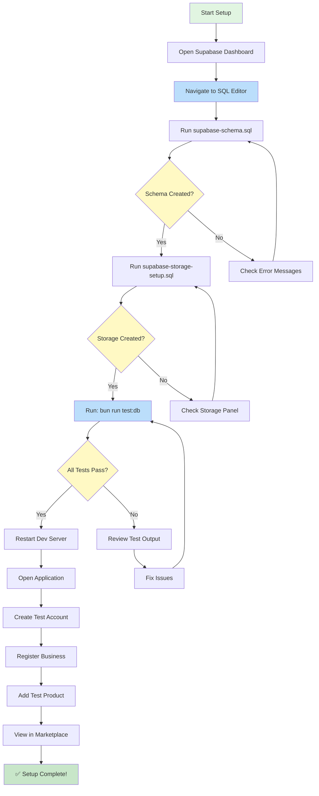
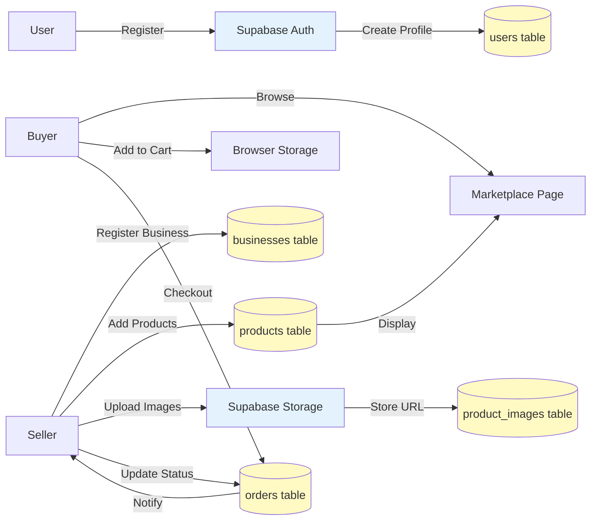

# Supabase Setup Flow - Visual Guide

## 🗺️ Setup Flow Diagram



---

## 📋 Step-by-Step Breakdown

### Phase 1: Database Setup (5 mins)

```
┌─────────────────────────────────────┐
│ 1. Open Supabase SQL Editor         │
│    URL: supabase.com/dashboard/...  │
└─────────────────┬───────────────────┘
                  │
                  v
┌─────────────────────────────────────┐
│ 2. Run supabase-schema.sql          │
│    • Copy entire file               │
│    • Paste in SQL Editor            │
│    • Click "Run"                    │
│    • Wait 15-30 seconds             │
└─────────────────┬───────────────────┘
                  │
                  v
┌─────────────────────────────────────┐
│ ✓ Created:                          │
│   - 18 tables                       │
│   - All indexes                     │
│   - RLS policies                    │
│   - 11 categories                   │
└─────────────────────────────────────┘
```

### Phase 2: Storage Setup (2 mins)

```
┌─────────────────────────────────────┐
│ 3. Run supabase-storage-setup.sql   │
│    • New Query                      │
│    • Copy entire file               │
│    • Paste and Run                  │
└─────────────────┬───────────────────┘
                  │
                  v
┌─────────────────────────────────────┐
│ ✓ Created:                          │
│   - product-images bucket           │
│   - business-logos bucket           │
│   - business-covers bucket          │
│   - Storage policies                │
└─────────────────────────────────────┘
```

### Phase 3: Verification (2 mins)

```
┌─────────────────────────────────────┐
│ 4. Run Test Script                  │
│    Terminal: bun run test:db        │
└─────────────────┬───────────────────┘
                  │
                  v
┌─────────────────────────────────────┐
│ Tests Check:                        │
│ ✓ Categories (11 found)             │
│ ✓ Tables (18 found)                 │
│ ✓ Storage buckets (3 found)         │
│ ✓ Products table accessible         │
│ ✓ Businesses table accessible       │
└─────────────────┬───────────────────┘
                  │
                  v
┌─────────────────────────────────────┐
│ 🎉 All Tests Passed!                │
└─────────────────────────────────────┘
```

### Phase 4: Application Test (5 mins)

```
┌─────────────────────────────────────┐
│ 5. Restart Dev Server               │
│    Ctrl+C, then: bun run dev        │
└─────────────────┬───────────────────┘
                  │
                  v
┌─────────────────────────────────────┐
│ 6. Create Test Data                 │
│    → Register seller account        │
│    → Register business              │
│    → Add product with image         │
│    → View in marketplace            │
└─────────────────┬───────────────────┘
                  │
                  v
┌─────────────────────────────────────┐
│ ✓ Setup Complete!                   │
│   Ready to use marketplace          │
└─────────────────────────────────────┘
```

---

## 🔄 Data Flow After Setup



---

## 🎯 What Each File Does

### supabase-schema.sql
```
Creates the entire database structure:
├── Tables (18 total)
│   ├── Core: users, businesses, products
│   ├── Commerce: orders, order_items, reviews
│   ├── Media: product_images, product_variants
│   ├── Finance: wallets, transactions, payouts
│   ├── Logistics: delivery_providers, deliveries
│   ├── Support: memberships, training, tickets
│   └── System: announcements
│
├── Security (RLS)
│   ├── Public: categories, active products
│   ├── Private: orders, wallets, user data
│   └── Restricted: admin functions
│
└── Data
    └── Seed: 11 product categories
```

### supabase-storage-setup.sql
```
Creates file storage infrastructure:
├── Buckets
│   ├── product-images (5MB, public read)
│   ├── business-logos (2MB, public read)
│   └── business-covers (5MB, public read)
│
└── Policies
    ├── Anyone can view (public read)
    ├── Authenticated can upload
    └── Owners can delete
```

---

## 🚨 Common Issues & Quick Fixes

### Issue 1: SQL Fails to Run
```
Error: syntax error at or near "CREATE"

Fix:
1. Make sure you copied the ENTIRE file
2. Check you're in the correct project
3. Try running in smaller chunks
```

### Issue 2: Tables Already Exist
```
Error: relation "users" already exists

Fix:
1. Schema already ran - you're done!
2. Or drop tables and re-run (only if needed)
```

### Issue 3: Test Script Fails
```
Error: Unexpected any. Specify a different type.

Fix:
1. This is a linter warning, not a breaking error
2. Tests still run despite warnings
3. Check the actual test output for real errors
```

### Issue 4: Can't Upload Images
```
Error: Storage bucket does not exist

Fix:
1. Run supabase-storage-setup.sql
2. Verify buckets in Storage panel
3. Restart dev server
```

---

## ✅ Success Indicators

You'll know setup is successful when:

1. **SQL Editor shows**: "Success. No rows returned"
2. **Table Editor shows**: 18 tables with green shield icons
3. **Categories table has**: 11 rows of data
4. **Storage shows**: 3 buckets (product-images, business-logos, business-covers)
5. **Test script shows**: "🎉 All tests passed!"
6. **Application loads**: No console errors
7. **Can register**: New user account creates successfully
8. **Can add product**: Product appears in marketplace

---

## 📚 File Reference

- **Setup Guide**: `.same/QUICK_SETUP_CHECKLIST.md` (fastest)
- **Detailed Guide**: `.same/SUPABASE_SETUP_GUIDE.md` (comprehensive)
- **Database Schema**: `.same/supabase-schema.sql` (run this first)
- **Storage Setup**: `.same/supabase-storage-setup.sql` (run this second)
- **Test Script**: `scripts/test-db-connection.ts` (verify setup)
- **Features Doc**: `.same/FEATURES_COMPLETED.md` (what you can do)

---

**Total Setup Time**: ~15 minutes
**Difficulty**: Easy (copy/paste SQL)
**Prerequisites**: Supabase account (free tier works)

🚀 **Ready to begin? Start with `.same/QUICK_SETUP_CHECKLIST.md`**
